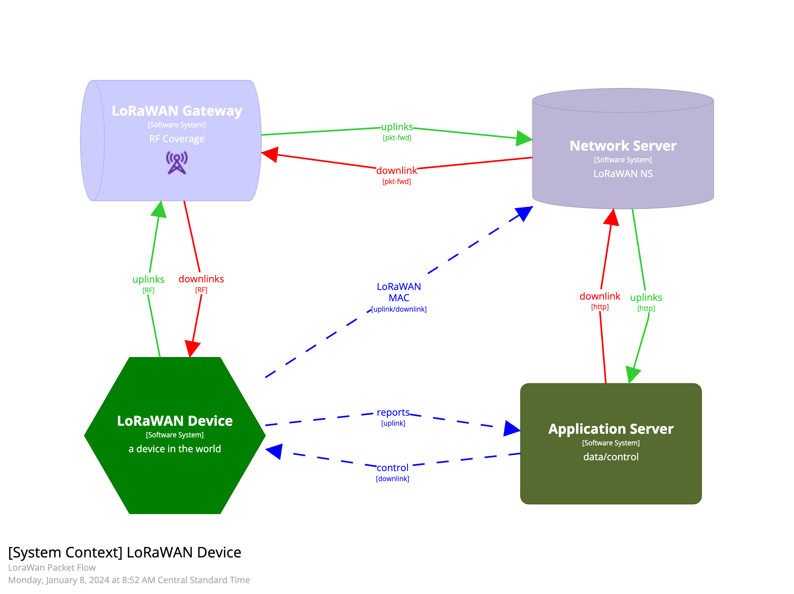

## LoRaWAN Overview

This page provides an overview of the primary LoRaWAN component
- device - collects and reports measurements from the physical world 
- gateway - provides coverage for devices, forwarding uplinks and downlinks between device and network server
- network server - provides device provisioning, data de-duplication, and applicaiton integration
- application server - decrypts, decodes, and stores the data, provides dashboards, reports, alerts, and some device controls

### What is LoRaWAN?

LoRaWAN is a Low-Power, Wide-Area Networking (LPWAN) technology to provide wireless bi-directional and secure connectivity to (typically) battery powered devices. LoRaWAN gateway "coverage" can provide connectivity to devices within several kilometers.

LoRaWAN is:
- [https://en.wikipedia.org/wiki/LoRa#LoRaWAN]()

### Building Blocks

More intro to the four (4) LoRaWAN building blocks; device, gateway, network server, application server.

#### Devices

LoRaWAN End Devices (aka devices), typically run off of battery and are designed to minimize power consumpting. These "devices" are enabled with various sensors for reporting and controlling **things** from the physical world.

LoRa technology and the LoRaWAN protocol enables devices to work at long distances and on low power. 

#### Gateways

##### Shared RF Spectrum

As LoRaWAN communications a shared medium (RF Spectrum), channel capacity may be shared by many devices. Large service deployments can result in channel capacity issues. High density wireless requires lower transmit levels and higher gateway capacities.

#### Network Server

The LoRaWAN Network Server (LNS) is used to route and de-duplicate traffic. The LNS provides addressing and join (auto-configure), Adaptive Data Rate (ADR), Downlink routing and other services. The LNS is at the heart of the LoRaWAN system.

#### Application Server

The Application Server has a lot of functions, starting with Decrypting the payload using the Application Session Key. After the Application server decrypts the payload, it will also need to route the payload for decoding and downstread storage and consumption (or is this upstream).

