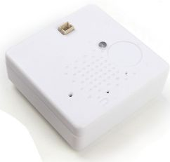
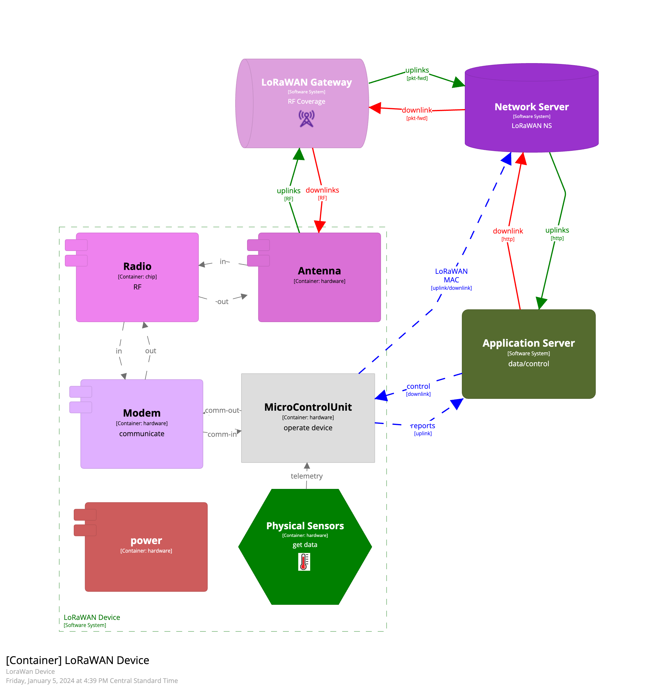

## Devices

LoRaWAN devices are designed to minimize power consumption and utilize very low bandwidth "chirps" to communicate **reports** to an application. Downlink capability depends on the LoRaWAN Device Class as listed below.
- Class A, downlinks only in response to uplinks, lowest power consumption.
- Class B, downlinks opened on periodic schedule, more power consumption.
- Class C, downlinks always enabled, highest power consumption.

### Example LoRaWAN End Device
The Tektelic Kona Home Sensor is a great indoor device. Affordable, easy to force an uplink/reset, readily available javascript decoder. ß

Learn more about the Tektelic Kona Home Sensor:
- [https://www.thethingsnetwork.org/forum/t/tektelic-smart-room-sensor-aka-kona-home-sensor/33896]()

### Pros and Cons
LoRaWAN device advantages:
- long-range and possibly low cost coverage
- long battery life possible for no/low power deployments

LoRaWAN device disadvantages:
- low bandwidth applications only
- finding coverage
- SF12 Well - devices can fall into worst preforming spreading factor polluting the shared spectrum

### Payload Design

Wireless communications can provide a challenging medium to achieve high resilience. There are many aspects of the physical environment affecting RF signal performance. The shared medium (RF spectrum) requires device cooperation and protocol mechanisms to help assure message delivery. 

LoRaWAN has particular challenges due to the large service area it can cover and the unlicensed RF spectrum it utlizes.

#### Device Side Data Reslience

Design payloads for device side data replication for message delivery resilience.

It is best to **NOT** depend on reliable transport mechanisms like Acks and Downlinks to ensure critical data is delivered. Repeat critical payloads a few times achieving much higher message delivery rate. 

A simplified example. On "Day A", each device will send the previous four days of billing info:
  - Day A billing
  - Day A-1 billing
  - Day A-2 billing
  - Day A-3 billing

By sending the critical date four (4) times, the message (Day A billing) will achieve a much higher success rate and not depend on downlinks.

#### Device Block Diagram

