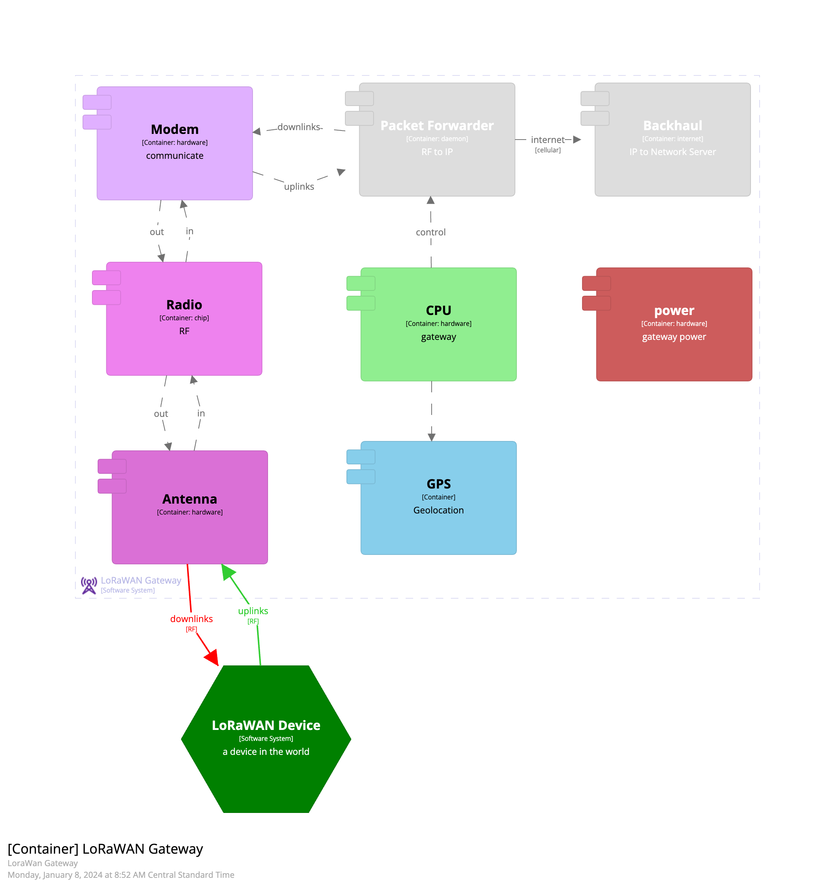

## Gateways

LoRaWAN Gateways provide RF (Radio Frequency) **coverage** to LoRaWAN devices.

### Received Frames

Device Uplinks _may_ be heard by one or more LoRaWAN Gateways. Any duplication caused by the reception of the uplink at multiple gateays will be resolved in the **de-duplication** function of the LoRaWAN Network Server.

The LoRaWAN gateway will add metadata to the received Uplinks and forward it to the LoRaWAN Network Server over an IP (Internet Protocol) network. 

### Packet Forwarder

The function in the LoRaWAN gateway that moves uplinks and downlinks between the RF link and the IP backhaul is called very generically called the **Packet Forwarder** or "pkt-fwd".

### Internet Backhaul

Backhaul for LoRaWAN gateways are typically provided by Cellular services or Ethernet cabling.

### Example LoRaWAN Gateway

Here is a photo of the Everynet Cloudcell LoRaWAN gateway.

### Gateway Reference Diagram

