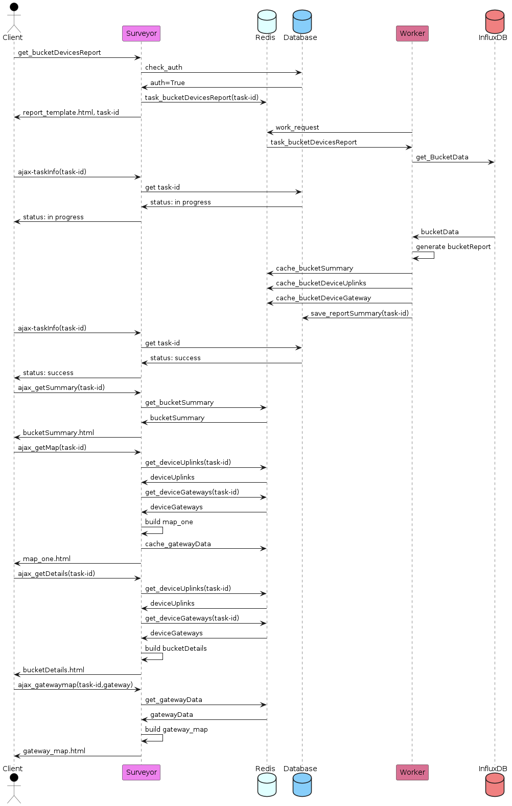

### Bucket Device Form

Use this view for viewing all the devices in an InfluxDB Bucket. Links are provided to inspect individual devices with PackGraph (single device packet history view).

Select the **Source**, type in the **Measurement** table name, adjust the __start__ and __end__ times as needed, then click **Submit**.

This report (BucketDevice View) is executed using an "Asynchronous Task", meaning that it will be given to the Surveyor_Worker to perform in the background.

Your browser will watch the status of the task then download the results into the web page using AJAX (background web) transactions.

Here is the Web Transaction view of this long running task:

Status icons are presented on the web browser to indicate report progress.

### Location Data

Fixed Location of Device (FLoD) Data, I made that up for fixed devices, can be provided in the Surveyor using one of two methods.
- bucketdevice admin pages allow uploading of device lat/long data using CSV
- retrieving the pluscode location (e.g. 8624C3F8+CW8) from the InfluxDB measurement data

**Note:** Only devices with locations will appear on the maps. All devices should appear in the tables.

### Report Sections

The BucketDevices report includes the following sections
- **Report Summary** - top level summary data
- **Packet Delivery Ratio (PDR) Distribution** - quick view of frame packet delivery performance
- **Geolocation Maps** - show PDR by location
- **Device Summary Report** - PDR table for all devices
- **Device/Gateway Summary Report** - frame information by device and gateway

Here is an example header showing report contents and a summary.

